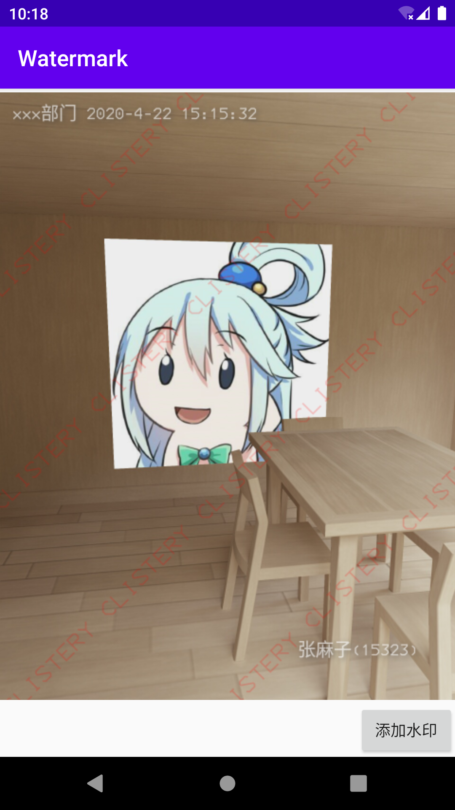

# Watermark

> 轻量级图片水印添加工具

1. 可以对任意可转为 Bitmap 的图片添加水印
2. 支持全图水印和锚点水印
3. 支持流式 API
4. 支持自定义字体
5. 支持自定义样式

## Example



## 依赖

### Gradle

```kts
implementation("io.github.clistery:watermark:1.3.1")
```

## 使用

  ```kotlin
  Watermark.create(capturedUri).setOutConfigure(0.5F, Bitmap.Config.ARGB_8888)
    .loadWatermark(
        // 全图水印
        FullTextWatermark("CLISTERY").setLineSpace(4).setMax(maxTextSize = 30F)
            .setTextStyle(Color.RED, Paint.Style.FILL, R.font.medium3270)
            .setAlpha((0xFF * 0.2).toInt()).setRotationAngle(-45F),
        // 锚点水印
        TextWatermark("xxx部门 2020-4-22 15:15:32").setMax(maxTextSize = 20F)
            .setTextStyle(Color.WHITE, Paint.Style.FILL, R.font.medium3270)
            .setTextShadow(4F, 2F, 2F, Color.DKGRAY).setPadding(5, 5, 5, 5)
            .setGravity(Gravity.TOP or Gravity.START)
            .setAlpha((0xFF * 0.65).toInt()),
        // 锚点水印
        TextWatermark("张麻子(15323)").setMax(maxTextSize = 20F)
            .setTextStyle(Color.WHITE, Paint.Style.FILL, R.font.medium3270)
            .setTextShadow(4F, 2F, 2F, Color.DKGRAY).setPadding(5, 5, 5, 5)
            .setGravity(Gravity.BOTTOM or Gravity.END)
            .setAlpha((0xFF * 0.65).toInt())
    ).getWatermarkBitmap()
  ```
